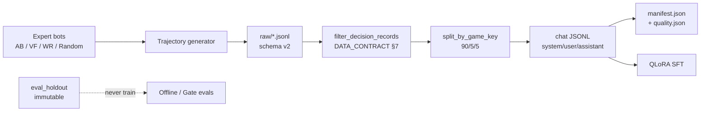
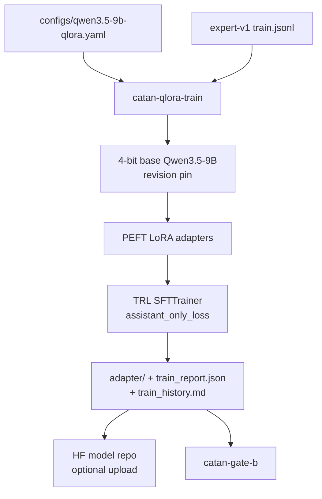
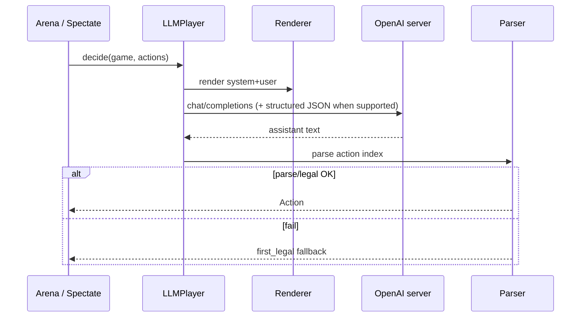

# Architecture

Implementation map for **catan-llm**. Normative product intent stays in
[`SCOPE.md`](SCOPE.md); this doc describes **what is in the repo today** and how
artifacts flow between components.

**Status snapshot:** [`STATUS.md`](STATUS.md)

---

## 1. End-to-end system

```text
 ┌─────────────────┐   raw JSONL trajectories   ┌──────────────────┐
 │  SIMULATOR      │ ─────────────────────────▶ │  DATA PIPELINE   │
 │  (Catanatron)   │                            │  schema v2       │
 │  sim/ + scripts │ ◀── LLMPlayer decisions ── │  quality filters │
 └────────┬────────┘                            └────────┬─────────┘
          │                                              │ chat JSONL
          │                                              │ + manifest
          │                                              ▼
 ┌────────┴────────┐   OpenAI HTTP    ┌──────────────────┐   adapter   ┌──────────────┐
 │ LIVE PLAY /     │ ◀─────────────── │ SERVING          │ ◀────────── │ TRAINING     │
 │ SPECTATE        │                  │ serve/ (+ vLLM)  │             │ QLoRA SFT    │
 │ play/           │                  └──────────────────┘             │ training/    │
 └────────┬────────┘                                                   └──────┬───────┘
          │                                                                    │
          │   MatchStats / Gate B                                              │ checkpoints
          ▼                                                                    ▼
 ┌─────────────────┐                                                  HF Hub artifacts
 │ EVAL ARENA      │                                                  (datasets/models)
 │ eval/           │
 └─────────────────┘
```

### Lifecycle (happy path)

1. **Generate** expert games → `data/phase1/raw/*.jsonl` (`catan-phase1-cohort` / `catan-generate`).
2. **Build** chat dataset → `processed/expert-v1/{train,val,test}.jsonl` + `manifest.json` / `quality.json`.
3. **Train** QLoRA on rental GPU → `outputs/sft/…/adapter` + `train_report.json` / `train_history.md`.
4. **Serve** adapter (vLLM or transformers) → OpenAI-compatible `/v1/chat/completions`.
5. **Eval** `ladder-4p` / `ab-4p` via arena → Gate B / Gate C JSON under `outputs/arena/`.
6. **Spectate** with `catan-spectate --watch` (terminal) or Catanatron web UI (Docker).

---

## 2. Package layout

```text
src/catan_llm/
├── sim/           # Catanatron adapter, bots, trajectory generation
├── data/          # schema v2, renderer, parser, dataset builder, quality, seeds, Tier A
├── training/      # SFT smoke, QLoRA production, masking, PEFT infer
├── eval/          # arena fixtures, MatchStats / Gate-B metrics
├── play/          # LLMPlayer, spectate accumulator / replay
├── serve/         # mock server, OpenAI client, constrained-decoding helpers
└── scripts/       # CLIs (entry points in pyproject.toml)
configs/
├── qwen3.5-9b-qlora.yaml    # pinned production train config
scripts/                     # HF Jobs bootstraps (rental_*.sh / *.py)
docs/                        # contracts, status, architecture, reports
```

| Package | Responsibility |
|---|---|
| `sim/` | Pin engine commit; play games; emit `DecisionRecord` rows with live prompts |
| `data/` | Schema validation, chat conversion, splits by `game_key`, §7 filters, manifests |
| `training/` | Assistant-only loss masking; QLoRA train/resume; PEFT generate |
| `eval/` | Seeded multi-seat matches; win/parse/legality/fallback metrics |
| `play/` | `LLMPlayer` (prompt → complete → parse → `first_legal`); spectate |
| `serve/` | HTTP client + mock OpenAI server; structured JSON request shaping |

---

## 3. Data architecture



### Identity & parity (hard gates)

- Every decision carries `game_key`, `map_hash`, `prompt_version`, `schema_version=v2`.
- `system_prompt` / `user_prompt` are captured from the **same** `render_*` functions used live.
- Splits are by **`game_key`**, never UUID `game_id`.
- Seeds only from [`SEED_REGISTRY.md`](SEED_REGISTRY.md) (`train_main` vs `eval_holdout` disjoint).
- Train context floor: **`max_seq_length ≥ 4096`** (no silent label truncation).

### Published Phase-1 artifacts

| Role | Location |
|---|---|
| Train/val/test | HF dataset `AlCampbell/catan-llm-phase1` → `processed/expert-v1/` |
| Quality sidecar | `quality.json` + manifest `max_seq_length` (ticket 14 backfill) |
| Holdout | Mac `eval-holdout-v1/` (upload to HF still outstanding) |

Details: [`DATA_CONTRACT.md`](DATA_CONTRACT.md), [`reports/phase1_quality_signoff.md`](reports/phase1_quality_signoff.md).

---

## 4. Training architecture



| Concern | Choice |
|---|---|
| Base | `Qwen/Qwen3.5-9B` revision pinned after L40S smoke |
| Method | QLoRA NF4 + LoRA r=16 on attention/MLP projections |
| Loss | **Assistant tokens only** (`assistant_only_loss`) |
| Hardware | Rental ≥24GB (L40S proven); local 16GB train **no-go** @ 4096 |
| Ops | [`TRAINING.md`](TRAINING.md), `scripts/rental_sft_gate_b*.sh` |

Smoke path (CPU): `catan-sft-smoke` on SmolLM — wiring only, not skill evidence.

---

## 5. Serving, play, spectate



| Path | CLI / module |
|---|---|
| Mock serve (CI/laptop) | `catan-serve --mock` |
| Real serve | vLLM recipe in [`SERVING.md`](SERVING.md) |
| Headless play | `catan-play-endpoint` |
| Terminal watch + replay | `catan-spectate --watch` → [`SPECTATE.md`](SPECTATE.md) |
| In-process PEFT (Gate B) | `training/peft_infer.py` (no HTTP) |

Fallback policy is locked: **`first_legal`**.

---

## 6. Evaluation architecture

```text
                    ┌── ladder-4p ── candidate vs Random / WR / ValueFunction
 Gate B (SFT)  ─────┤   seeds: ladder_sft_gate   ≥200 finished
                    └── metrics: parse/legality ≥0.995; cand WR > WR seat

                    ┌── ab-4p ── candidate vs AlphaBeta / VF / Random
 Gate C (RL)   ─────┤   seeds: champion_ab        ≥1000 finished
                    └── headline skill claim vs pinned AlphaBeta
```

Implementation: `eval/arena.py` + `eval/metrics.py` → `catan-arena` / `catan-gate-b`.  
Normative rules: [`EVAL_PROTOCOL.md`](EVAL_PROTOCOL.md).

**Important:** “beats WeightedRandom” means **higher win share in the same 4p games**, not candidate WR > 50%.

---

## 7. CLI map

| Command | Purpose |
|---|---|
| `catan-generate` | Bulk trajectories |
| `catan-phase1-cohort` | Stop-at-target train / holdout cohort |
| `catan-build-dataset` | Trajectories → chat JSONL + manifest |
| `catan-sft-smoke` | Tiny SmolLM end-to-end smoke |
| `catan-qlora-train` | Production Qwen3.5-9B QLoRA |
| `catan-gate-b` | Ladder Gate B vs adapter |
| `catan-arena` | Fixture / bot-ladder eval |
| `catan-serve` | Mock (or print vLLM recipe) |
| `catan-play-endpoint` | Play via HTTP endpoint |
| `catan-spectate` | Terminal spectate + replay JSON |

---

## 8. Runtime topology (today)

| Workload | Where | Notes |
|---|---|---|
| Data generation | Mac / cloud CPU | Prefer Mac 48GB for long burns |
| Dataset build / quality | CPU | Tokenizer optional for truncation audit |
| QLoRA train @ 4096 | HF Jobs `l40sx1` (or other ≥24GB) | ~$1.80/hr on L40S |
| Gate B / spectate infer | Same rental GPU or serve+CPU arena | ~3–4 min/game @ 9B generate |
| CI | GitHub Actions CPU | No 9B downloads; mock serve + unit gates |

---

## 9. Trust boundaries / POV

```text
 Teacher (AlphaBeta / VF)     may see full engine state when choosing actions
        │
        ▼ actions only ─────────────────────────────┐
                                                    │
 Learner prompts + Tier A text  ◀── POV-limited ────┘
 (no opponent private hands in rationale strings)
```

See [`TEACHER_POV.md`](TEACHER_POV.md). CI greps rationale leakage patterns.

---

## 10. Related docs

| Doc | Role |
|---|---|
| [`STATUS.md`](STATUS.md) | Phase scoreboard / next steps |
| [`TRAINING.md`](TRAINING.md) | How to run QLoRA + Jobs |
| [`SERVING.md`](SERVING.md) / [`SPECTATE.md`](SPECTATE.md) | Deploy & watch |
| [`DATA_CONTRACT.md`](DATA_CONTRACT.md) / [`EVAL_PROTOCOL.md`](EVAL_PROTOCOL.md) | Contracts |
| [`tickets/BACKLOG.md`](tickets/BACKLOG.md) | Work queue |
